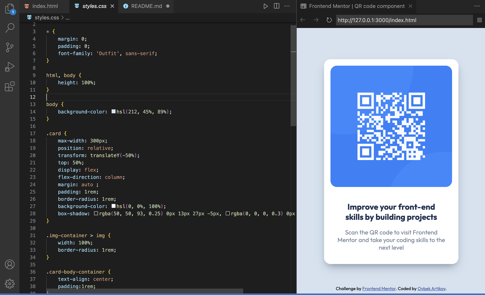

# Frontend Mentor - QR code component solution

This is a solution to the [QR code component challenge on Frontend Mentor](https://www.frontendmentor.io/challenges/qr-code-component-iux_sIO_H). 

## Table of contents

- [Frontend Mentor - QR code component solution](#frontend-mentor---qr-code-component-solution)
  - [Table of contents](#table-of-contents)
  - [Overview](#overview)
    - [Screenshot](#screenshot)
    - [Links](#links)
  - [My process](#my-process)
    - [Built with](#built-with)
    - [What I learned](#what-i-learned)
    - [Useful resources](#useful-resources)
  - [Author](#author)

## Overview

### Screenshot

### Links

- Solution URL: [Github URL](https://github.com/artikov/qr-code-css/)
- Live Site URL: [Live at](https://artikov.github.io/qr-code-css/)

## My process

### Built with

- Semantic HTML5 markup
- CSS custom properties
- Flexbox
- CSS Grid
- Mobile-first workflow

### What I learned

I improved my css skills

### Useful resources

- [W3DOCS](https://www.www.w3docs.com) - This helped me for  centering a div.
- [Stack Overflow](https://www.stackoverflow.com) - This is an amazing website to find a relevant solutions for problems.

## Author

- Website - [artikov.site](https://www.artikov.site)
- Frontend Mentor - [@artikov](https://www.frontendmentor.io/profile/artikov)
- Twitter - [@artikov08](https://www.twitter.com/artikov08)
